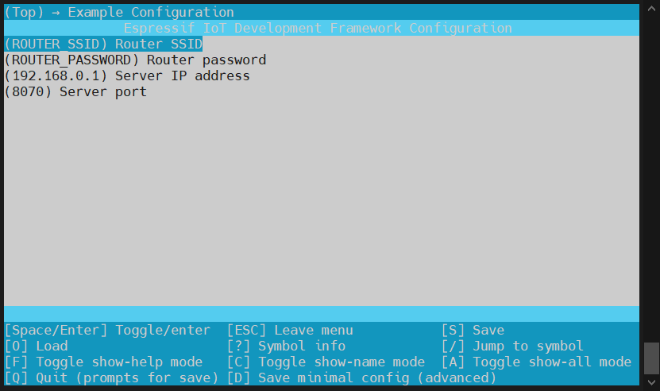

[[中文]](./README_cn.md)

# Mwifi Router Example

## Introduction

This example will introduce how to implement a device connection to a remote external server based on Mesh-Lite. Different from ESP-WIFI-MESH, each device in the Mesh-Lite network can independently access the external network.

This example implements the function of device data transmission in the mesh network to the TCP server.

**It is recommended to compile with esp-idf version 4.4**

## Hardware

* At least 2 x ESP32 development boards
* 1 x router that supports 2.4G

## Process

### Run TCP server

1. Connect PC or the mobile phone to the router.
2. Use a TCP testing tool (any third-party TCP testing software) to create a TCP server.

### Configure the devices

Enter `idf.py menuconfig`, and configure the followings under the submenu "Example Configuration".

 * The router information.
 * ESP-WIFI-MESH network: The network password length should be between 8 and 64 bits (both exclusive), and the network will not be encrypted if you leave the password blank.
 * TCP server: the information of the TCP server run on the PC.

<div align=center>

<p> Configure the devices </p>
</div>
### Build and Flash

CMake:
```shell
idf.py erase_flash flash monitor -b 921600 -p /dev/ttyUSBx
```

### Run

ESP-WIFI-MESH devices send the real-time device status to the TCP server at an interval of three seconds.